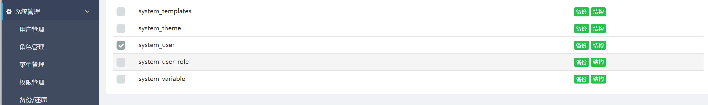
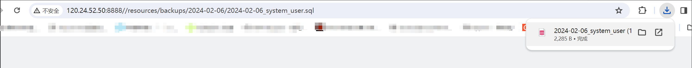
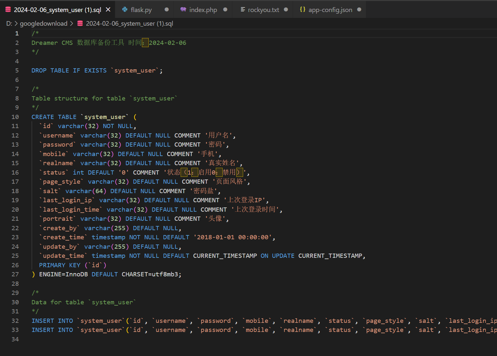
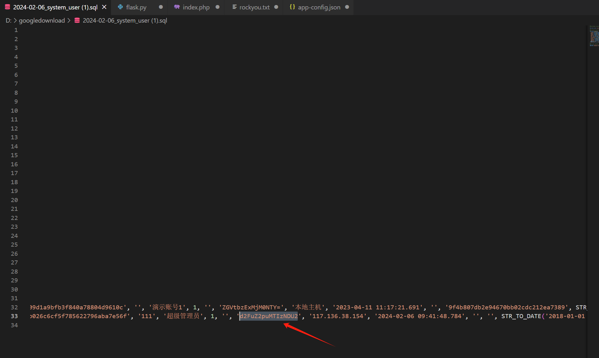

version:4.0.3

Dreamer CMS v4.1.3 was discovered to contain a Unauthorized access vulnerability via the component /resources/backups/2024-02-06/2024-02-06_system_user.sql.An attacker can traverse dates to download backup files, causing information leakage.

Use POC verification after logging out

Sensitive information leaked

